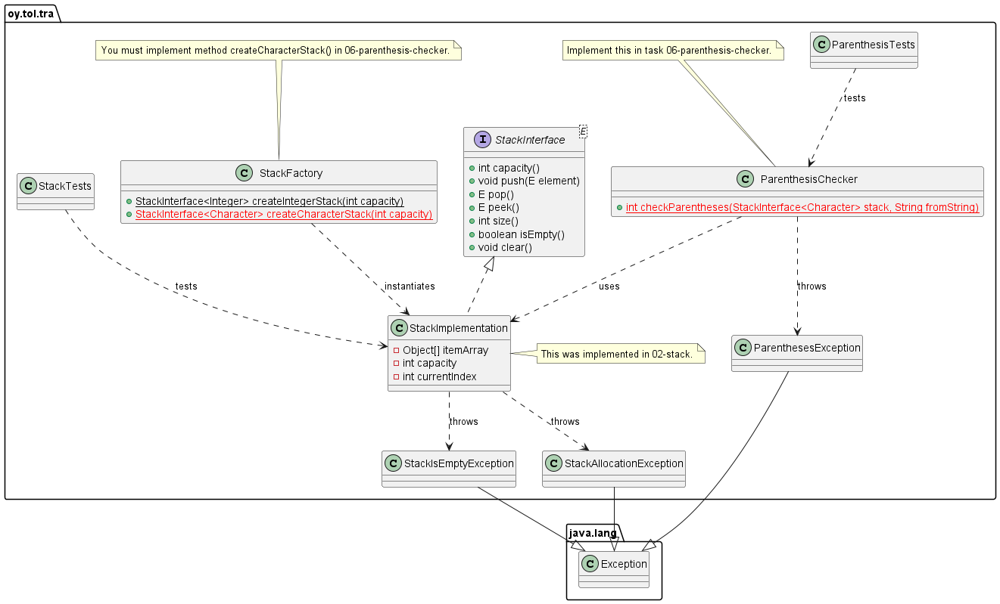

# Stack exercise part 2

Tietorakenteet ja algoritmit | Data structures and algorithms

## The goal

The goal of this exercise is to test the stack data structure that you created to perform an actual useful task. You will use the stack to check if parentheses in structured text (files) are correct or not.

For example, this is a valid text considering the usage of parentheses, retrieved from [Linnanmaa weather station](http://weather.willab.fi/weather.json):

```JSON
{
  "tempnow": 1.7,
  "temphi": 7.4,
  "templo": -1.6,
  "dewpoint": 1.4,
  "humidity": 98,
  "airpressure": 1005.1,
  "windspeed": 3.3,
  "windspeedmax": 7.6,
  "winddir": 174,
  "precipitation1d": 0,
  "precipitation1h": 0,
  "timestamp": "2021-10-14 11:11 EEST"
}
```
But this Java sample code has a problem; there is an extra closing `}` before last line:

```Java
  if (currentIndex >= capacity - 1) {
    reallocateInternalArray();
    }
  }
  itemArray[++currentIndex] = element;         
```
The implementation should report the first JSON as valid, and the second Java example as invalid because the parentheses do not match.

## Prerequisites

You have completed 02-stack and your `StackImplementation` passes the `StackTests`.

## Instructions

Here you can see the class diagram from 02-stack task updated for this task.



First, **copy** your `StackImplementation.java` file **from** the `02-stack` task **to** `src/main/java/yo/tol/tra` folder of this task.

In this exercise you will use your `StackImplementation` to handle Character data type instead of Integer. 

Following the implementation of the `StackFactory.createIntegerStack()` **implement** another method which creates a Character stack.

**Open** the test `ParenthesisTests.java`. You will see that it contains unit tests to check if two files have correct parentheses or not. The tests use a `ParenthesisChecker.checkParentheses()` method to do the actual checking.

**Your task** is to **implement the `ParenthesisChecker.checkParentheses()` method** so that it uses the `StackImplementation` that you finished earlier to check if the files to be tested have correct parenthesis or not.

> Note that in implementing `ParenthesisChecker.checkParentheses()` you **must not** allocate memory, but use the existing variables as they are. For example calling `String.toCharArray()` *does allocate* memory, so you must not use it.

There are test data files that are used in the tests, in the project `src/test/resources` directory. The `SSN.java` is correct, but the `Person.json` file is not. That is why the test for the second file expects it to throw an exception:

```Java
   assertThrows(ParenthesesException.class, () -> checkParentheses(toCheck), "Person.json is invalid JSON so must throw");
```
Note that the test still passes successfully, since the failure to check the Person.json file is *expected*. If the test would actually fail, it would mean that checkParentheses() would _not_ throw -- that would be a real problem, and a failure in *your* implementation if that would happen.

**Follow the instructions** in the comments of `ParenthesisChecker.checkParentheses()` and implement the method. 

Method must check if the string has correct parenthesis, using the stack you implemented. The method must throw an exception, if the parentheses are not correct.

## Testing 

**Run the ParenthesisTests tests** to make sure your stack implementation passes the unit tests. From command line, you can execute the tests (in the directory that contains the exercise `pom.xml` file):

```
mvn -Dtest=ParenthesisTests test
```

If the tests do not pass, you will see errors. Otherwise you will see that the tests succeed. 

Note that at this point you can also execute all the tests:

```
mvn test
```

Especially if you have *changed* your `StackImplementation` to fix any issues with it, it is necessary to execute *regression testing* (running the already executed tests again).

When working with this exercise, **do not**:

* change the `StackInterface` class in any way,
* change the unit tests in any way,
* change the `SSN.java` nor `Person.json` files in any way.

## Delivery

After all your tests pass, you should deliver your submission to the exercise as instructed in the course.

## Questions or problems?

Participate in the course lectures and exercise sessions. However, this task, as it affects grade, you should work as independently as possible and utilize what you have already learned.

## About

* Course material for Tietorakenteet ja algoritmit | Data structures and algorithms 2021.
* Study Program for Information Processing Science, University of Oulu.
* Antti Juustila, INTERACT Research Group.
* Modificatoins for NJIT 2024:
* Pertti Karhapää, M3S Research Unit.
